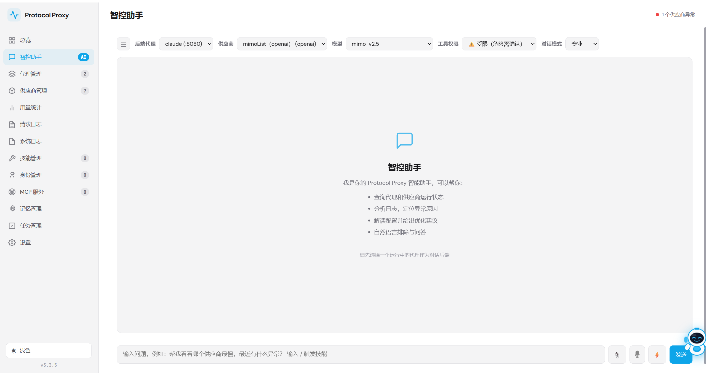
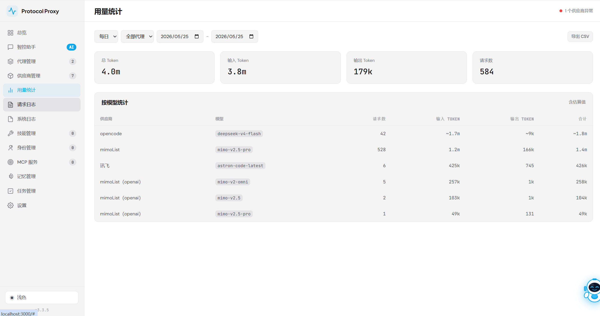
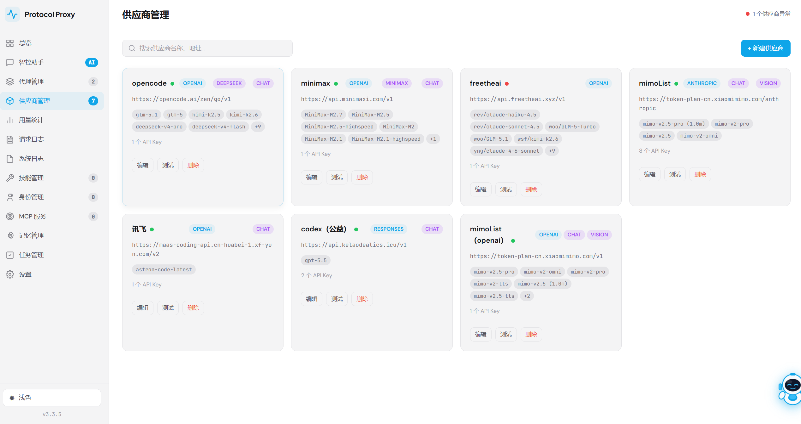
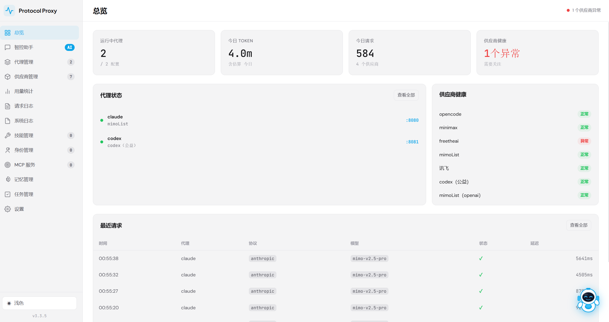
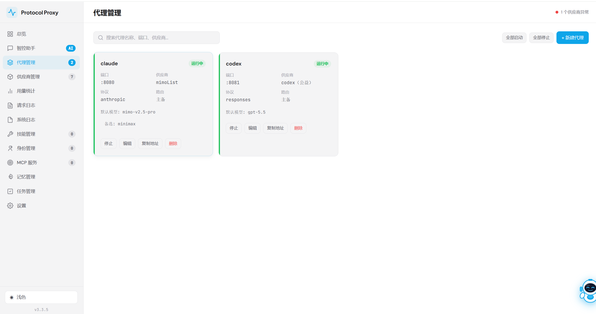
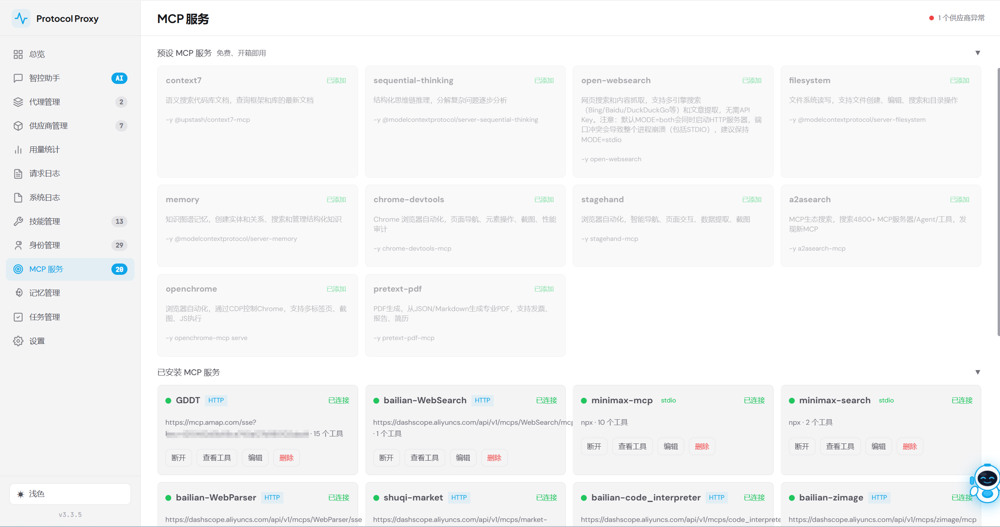
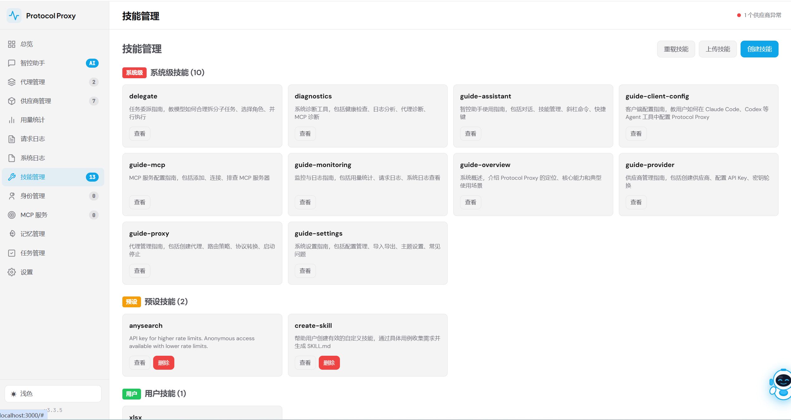

# Protocol Proxy

[English](./README_EN.md) | 中文

[](https://www.npmjs.com/package/protocol-proxy)
[](https://nodejs.org/)
[](./LICENSE)
[](https://github.com/liaoxinjie666/protocol-proxy)

OpenAI / Anthropic / Gemini 协议转换透明代理与 AI 运维管理平台。

## 功能特性

### 协议转换与代理
- **多协议转换**：OpenAI ↔ Anthropic ↔ Gemini 双向自动识别并转换，支持 Responses API
- **多端口代理**：每个代理端口独立运行，互不干扰
- **默认 Model 注入**：可为每个代理配置默认 Model，请求未携带 model 时自动注入
- **流式输出支持**：SSE 实时转换，包括工具调用场景
- **工具调用转换**：functions/tool_calls ↔ tool_use/tool_result 完整映射
- **配置热更新**：修改目标地址、Model 等配置后即时生效，无需重启代理
- **Agent 身份验证**：可选 Bearer Token 认证

### 供应商适配器
内置国内主流模型适配器，自动处理协议差异：
- **qwen**（通义千问）、**deepseek**（DeepSeek）、**kimi**（Moonshot）
- **doubao**（豆包）、**zhipu**（智谱）、**minimax**（MiniMax）

### 智控助手（AI 运维助手）
基于 SSE 的内置 AI 管理助手，支持：
- **60+ 内置工具**：系统查询、供应商/代理管理、文件操作、命令执行、配置管理
- **MCP 扩展**：通过 MCP 协议接入外部工具（搜索、文件系统、浏览器自动化、PDF 生成等）
- **技能系统**：预定义指令模板，通过 `/技能名` 触发
- **持久记忆**：跨会话记忆（一级记忆始终注入、二级记忆按需加载、SOUL 人设）
- **多 Agent 委派**：将大任务拆分为多个子任务并行执行，支持角色隔离

### 配置管理
- **版本快照**：自动保存配置变更历史，支持回滚与差异对比
- **增量差异重建**：即使快照被清理，也能通过差异链回溯历史版本
- **配置导入导出**：支持 overwrite / merge 两种导入模式

## 截图

| 总览 | 智控助手 | 代理管理 |
|:---:|:---:|:---:|
|  |  |  |

| 用量统计 | 供应商管理 | MCP 服务 |
|:---:|:---:|:---:|
|  |  |  |

| 技能管理 |
|:---:|
|  |

## 快速开始

```bash
# 1. 安装依赖
npm install

# 2. 启动服务
npm start

# 3. 打开管理界面
open http://localhost:3000
```

## 配置说明

### 供应商（Provider）

```json
{
  "providers": [
    {
      "id": "openai",
      "name": "OpenAI",
      "url": "https://api.openai.com",
      "protocol": "openai",
      "apiKeys": [{ "key": "sk-xxx", "alias": "主密钥", "enabled": true }],
      "models": ["gpt-4o", "gpt-4o-mini"],
      "adapter": "",
      "capabilities": ["tools", "vision", "json"]
    }
  ]
}
```

| 字段 | 说明 |
|------|------|
| `url` | 供应商 API 地址 |
| `protocol` | 协议类型：`openai`、`anthropic`、`gemini` |
| `apiKeys` | API Key 列表，支持别名和启停状态 |
| `adapter` | 适配器名称（如 `deepseek`、`kimi`），用于国内模型特殊处理 |
| `capabilities` | 能力标签（`tools`、`vision`、`json` 等） |
| `azureDeployment` | Azure OpenAI 部署名（仅 Azure） |
| `azureApiVersion` | Azure OpenAI API 版本（仅 Azure） |

### 代理（Proxy）

```json
{
  "proxies": [
    {
      "id": "default",
      "name": "默认代理",
      "port": 8080,
      "providerId": "openai",
      "defaultModel": "gpt-4o",
      "routingStrategy": "primary_fallback",
      "providerPool": [
        { "providerId": "openai", "model": "gpt-4o", "weight": 2 },
        { "providerId": "deepseek", "model": "deepseek-chat", "weight": 1 }
      ]
    }
  ]
}
```

| 字段 | 说明 |
|------|------|
| `port` | 代理监听端口 |
| `providerId` | 主供应商 ID |
| `defaultModel` | 默认模型 |
| `routingStrategy` | 路由策略：`primary_fallback`（主备）、`round_robin`（轮询）、`weighted`（加权）、`fastest`（最快响应） |
| `providerPool` | 多供应商池，用于路由策略（可选） |
| `requireAuth` | 是否启用 Bearer Token 认证 |

### 路由策略

- **primary_fallback**：优先使用主供应商，失败时按池顺序 fallback
- **round_robin**：在供应商池中轮询
- **weighted**：按 weight 权重分配请求
- **fastest**：自动选择延迟最低的供应商

## 使用流程

1. 在管理界面（`http://localhost:3000`）创建供应商，配置 API 地址和 Key
2. 创建代理，选择供应商、端口和路由策略
3. Agent 配置 base URL 为代理地址，例如 `http://localhost:8080`
4. Agent 正常发送请求（OpenAI / Anthropic / Gemini 格式均可）
5. 代理自动识别入站协议，必要时进行协议转换后转发到目标供应商

## 客户端配置示例

### Claude Code

```bash
# 设置环境变量
export ANTHROPIC_BASE_URL=http://localhost:8080
export ANTHROPIC_API_KEY=your-api-key

# 直接使用
claude
```

### Cursor

在 Cursor Settings → Models → OpenAI API Key 中：
- **API Key**: 填入你的 Key
- **Override OpenAI Base URL**: `http://localhost:8080`

### Python (OpenAI SDK)

```python
from openai import OpenAI

client = OpenAI(
    base_url="http://localhost:8080/v1",
    api_key="your-api-key"
)

response = client.chat.completions.create(
    model="gpt-4o",
    messages=[{"role": "user", "content": "Hello!"}]
)
print(response.choices[0].message.content)
```

### Python (Anthropic SDK)

```python
import anthropic

client = anthropic.Anthropic(
    base_url="http://localhost:8080",
    api_key="your-api-key"
)

message = client.messages.create(
    model="claude-sonnet-4-20250514",
    max_tokens=1024,
    messages=[{"role": "user", "content": "Hello!"}]
)
print(message.content[0].text)
```

### curl

```bash
# OpenAI 格式
curl http://localhost:8080/v1/chat/completions \
  -H "Content-Type: application/json" \
  -H "Authorization: Bearer your-api-key" \
  -d '{"model": "gpt-4o", "messages": [{"role": "user", "content": "Hello!"}]}'

# Anthropic 格式
curl http://localhost:8080/v1/messages \
  -H "Content-Type: application/json" \
  -H "x-api-key: your-api-key" \
  -H "anthropic-version: 2023-06-01" \
  -d '{"model": "claude-sonnet-4-20250514", "max_tokens": 1024, "messages": [{"role": "user", "content": "Hello!"}]}'
```

## 智控助手

管理界面右侧为智控助手面板，你可以用自然语言与助手交互：

- 查询系统状态、代理运行状态、API Key 健康度
- 创建/修改/删除供应商和代理
- 查看日志、分析异常、执行命令
- 通过 `/技能名` 触发预定义技能
- 委派子 Agent 并行处理复杂任务

助手支持的工具类别：
- **系统查询**：状态、用量、日志、健康检查
- **文件操作**：读取、写入、搜索、替换、执行命令
- **供应商管理**：增删改查、Key 测试、模型列表拉取
- **代理管理**：增删改查、启停、批量操作
- **MCP 管理**：连接外部工具服务器
- **技能管理**：创建自定义指令模板
- **配置管理**：导入导出、快照回滚、差异对比
- **记忆系统**：保存跨会话记忆、人设定义
- **多 Agent 委派**：并行子任务、任务状态查询

## 文件结构

```
protocol-proxy/
├── server.js              # 管理服务器与代理入口
├── lib/
│   ├── adapters/          # 国内模型适配器（qwen/deepseek/kimi/doubao/zhipu/minimax）
│   ├── converters/        # 协议转换器（OpenAI/Anthropic/Gemini/Responses）
│   ├── multi-agent/       # 多 Agent 委派系统
│   ├── config-store.js    # 配置持久化与版本快照
│   ├── proxy-manager.js   # 代理端口生命周期管理
│   ├── proxy-server.js    # 单个代理端口的请求处理
│   ├── detector.js        # 入站协议检测
│   ├── prompt-builder.js  # 智控助手系统提示词构建
│   ├── conversation-store.js  # 对话历史持久化
│   ├── memory-manager.js  # 记忆系统管理
│   ├── skill-store.js     # 技能加载与管理
│   ├── agent-store.js     # 代理身份加载与管理
│   ├── mcp-client.js      # MCP 客户端连接与工具发现
│   └── exec-policy.js     # 命令执行策略引擎
├── public/                # 管理前端静态文件
├── config/
│   ├── mcp-presets.json   # MCP 服务器预设配置
│   └── proxies.json       # 默认配置文件（实际配置在用户目录）
├── agents/
│   ├── preset/            # 30+ 预设代理身份（开发/产品/运维等）
│   └── system/            # 系统代理
├── skills/
│   ├── preset/            # 预设技能
│   └── system/            # 系统技能（使用指南、诊断等）
└── package.json
```

## 技术栈

- Node.js 20+（原生 fetch + ReadableStream）
- Express（HTTP 服务）
- MCP SDK（外部工具接入）
- 纯 HTML/JS 管理前端

## 环境要求

- Node.js >= 20.0.0
